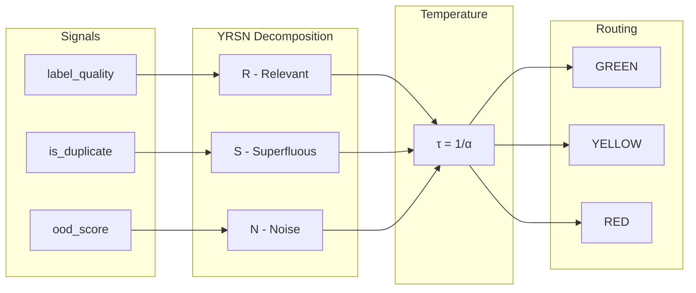

# YRSN-IARS: Intelligent Automation Routing System

**Demo code for implementing [YRSN](https://github.com/RudyMartin/yrsn-context) context decomposition with data quality signals**

This repository demonstrates how to implement the [YRSN framework](https://github.com/RudyMartin/yrsn-context) (Y = R + S + N) using data quality signals to route decisions through GREEN/YELLOW/RED automation streams.

## The Core Insight



**Temperature-Quality Duality**: `τ = 1/α` where α = quality score (R component)
- Low τ (high quality) → Tight thresholds → More automation
- High τ (low quality) → Loose thresholds → More human review

## Three-Stream Routing

| Stream | Confidence | Temperature | Action |
|--------|------------|-------------|--------|
| GREEN | Cs ≥ 0.95 | τ < 1.0 | Auto-approve |
| YELLOW | Cs ≥ 0.70 | τ ≈ 1.0 | AI-assisted review |
| RED | Cs < 0.70 | τ > 1.5 | Expert review |

## Collapse Type Detection

| Type | Condition | Routing Override |
|------|-----------|------------------|
| POISONING | N > 0.3 | Force RED |
| DISTRACTION | S > 0.4 | Prefer YELLOW |
| CONFUSION | N > 0.3 AND S > 0.25 | Force RED |
| CLASH | Risk > 0.6 | Check temperature |

## Repository Structure

```
yrsn-iars/
├── docs/                           # Documentation
│   ├── AWS_DEPLOYMENT_GUIDE.md    # AWS deployment instructions
│   ├── GCP_DEPLOYMENT_GUIDE.md    # GCP deployment instructions
│   └── INFRASTRUCTURE_DIAGRAMS.md # Mermaid architecture diagrams
├── specs/                          # Specifications
│   ├── IARS_MASTER_SPEC.md        # Master specification
│   ├── SIGNALS.md                 # Signal output documentation
│   ├── YRSN_MAPPING.md            # Signal → YRSN mapping rules
│   ├── NOTEBOOK_USE_CASE_MATRIX.md # Notebook progression guide
│   └── CODE_REVIEW_AND_FIXES.md   # Implementation notes
├── notebooks/                      # Progressive tutorials
│   ├── 01_cleanlab_for_approval_data.ipynb  # Easy: Basic approval
│   ├── 02_text_classification_quality.ipynb # Easy: Text classification
│   ├── 03_multi_annotator_consensus.ipynb   # Medium: Multi-approver
│   ├── 04_rag_retrieval_quality.ipynb       # Medium: RAG/retrieval
│   ├── 05_token_ner_quality.ipynb           # Hard: Token/NER
│   └── 06_production_pipeline.ipynb         # Hard: Full production
├── src/yrsn_iars/                  # Source code
│   ├── adapters/
│   │   └── signal_adapter.py      # Signal → YRSN conversion
│   ├── pipelines/
│   │   ├── approval_router.py     # Three-stream routing
│   │   └── temperature.py         # Temperature-quality duality
│   └── core/
│       └── types.py               # Core data types
├── examples/                       # Standalone examples
└── tests/                          # Test suite
```

## Quick Start

```python
from yrsn_iars.adapters import SignalAdapter
from yrsn_iars.pipelines import ApprovalRouter, TemperatureCalculator

# 1. Get quality scores from your data quality tool
quality_scores = get_quality_scores(labels, pred_probs)

# 2. Convert to YRSN decomposition
adapter = SignalAdapter()
yrsn = adapter.to_yrsn(quality_scores, pred_probs, labels)
print(f"R={yrsn.R:.3f}, S={yrsn.S:.3f}, N={yrsn.N:.3f}")

# 3. Calculate temperature
temp_calc = TemperatureCalculator()
tau = temp_calc.compute(yrsn)
print(f"Temperature τ={tau:.3f}")

# 4. Route the request
router = ApprovalRouter()
decision = router.route(
    confidence=pred_probs.max(),
    yrsn=yrsn,
    temperature=tau
)
print(f"Stream: {decision.stream}, Action: {decision.action}")
```

## Weighted Urgency Formula

```
U = w₁×T_expiry + w₂×P_business + w₃×S_sentiment + w₄×C_clarity

Where:
  T_expiry   = Time pressure (deadline proximity)
  P_business = Business priority (amount × level)
  S_sentiment = Sentiment urgency (NLP-derived)
  C_clarity  = Request clarity (R - N)

Default weights: w₁=0.4, w₂=0.3, w₃=0.2, w₄=0.1
```

## Cloud Deployment

### AWS Architecture

| Service | Purpose |
|---------|---------|
| API Gateway | REST API ingestion |
| Lambda | Serverless processing |
| Bedrock | Embeddings (Titan) + LLM (Claude) |
| SageMaker | Custom model hosting |
| DynamoDB | Decision storage |
| Step Functions | Workflow orchestration |
| S3 | Document/model storage |

See [AWS Deployment Guide](docs/AWS_DEPLOYMENT_GUIDE.md)

### GCP Architecture

| Service | Purpose |
|---------|---------|
| Cloud Endpoints | REST API ingestion |
| Cloud Run | Container processing |
| Vertex AI | Embeddings + predictions |
| Firestore | Decision storage |
| Workflows | Orchestration |
| Cloud Storage | Document/model storage |

See [GCP Deployment Guide](docs/GCP_DEPLOYMENT_GUIDE.md)

### Infrastructure Diagrams

Visual architecture diagrams available in [INFRASTRUCTURE_DIAGRAMS.md](docs/INFRASTRUCTURE_DIAGRAMS.md):
- AWS/GCP full architecture
- Data flow diagrams
- State machine workflows
- Multi-region deployment
- Security architecture
- CI/CD pipeline

## Notebooks

| # | Notebook | Difficulty | Domain |
|---|----------|------------|--------|
| 01 | Approval Data | Easy | Finance |
| 02 | Text Classification | Easy | Support |
| 03 | Multi-Annotator | Medium | Legal |
| 04 | RAG/Retrieval | Medium | Knowledge |
| 05 | Token/NER | Hard | Documents |
| 06 | Production Pipeline | Hard | Enterprise |

## Related Repositories

- [yrsn-context](https://github.com/RudyMartin/yrsn-context) - YRSN context engineering framework
- [yrsn-research](https://github.com/RudyMartin/yrsn-research) - YRSN research LLM algorithms

## License

**AGPL-3.0** - See [LICENSE](LICENSE) for details.
