# YRSN-IARS Infrastructure Diagrams

GitHub-compatible Mermaid diagrams for AWS and GCP deployments.

---

## AWS Architecture

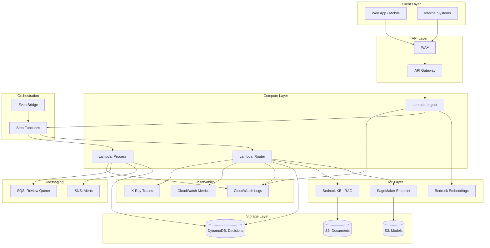

---

## AWS Data Flow

```mermaid
flowchart LR
    subgraph Input["1 - Request Input"]
        A1[Approval Request]
        A2[Text + Metadata]
    end

    subgraph Embedding["2 - Embedding"]
        B1[Bedrock Titan]
        B2[768-dim Vector]
    end

    subgraph Classification["3 - Classification"]
        C1[SageMaker Endpoint]
        C2[Prediction Probs]
        C3[Confidence Score]
    end

    subgraph YRSN["4 - YRSN Analysis"]
        D1[CleanlabAdapter]
        D2[R Component]
        D3[S Component]
        D4[N Component]
    end

    subgraph Temperature["5 - Temperature"]
        E1[Compute Tau]
        E2[Adjust Thresholds]
    end

    subgraph Routing["6 - Routing Decision"]
        F1{Stream?}
        F2[GREEN: Auto]
        F3[YELLOW: Assist]
        F4[RED: Expert]
    end

    subgraph Output["7 - Output"]
        G1[DynamoDB Store]
        G2[SNS Notify]
        G3[API Response]
    end

    A1 --> A2
    A2 --> B1
    B1 --> B2
    B2 --> C1
    C1 --> C2
    C2 --> C3
    C3 --> D1
    D1 --> D2
    D1 --> D3
    D1 --> D4
    D2 --> E1
    E1 --> E2
    E2 --> F1
    F1 -->|High Cs Low Tau| F2
    F1 -->|Medium| F3
    F1 -->|Low Cs High Tau| F4
    F2 --> G1
    F3 --> G1
    F4 --> G1
    F3 --> G2
    F4 --> G2
    G1 --> G3
```

---

## AWS Step Functions Workflow

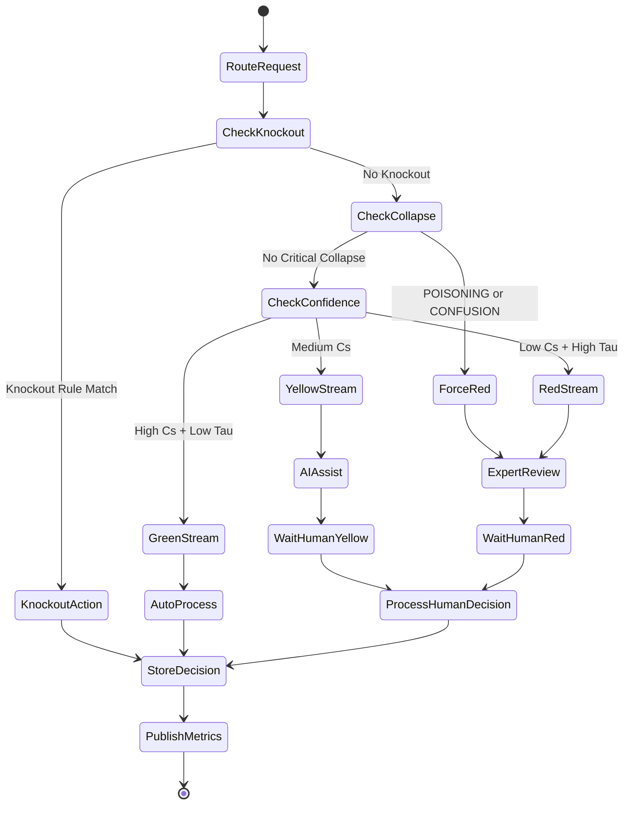

---

## GCP Architecture

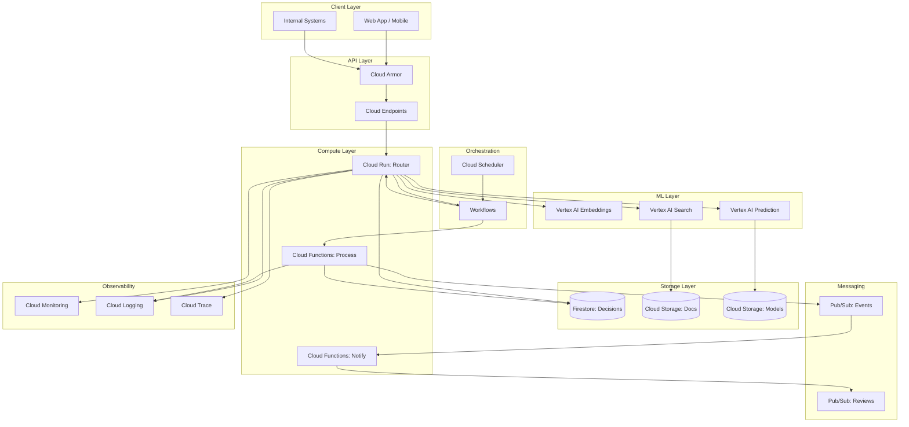

---

## GCP Data Flow

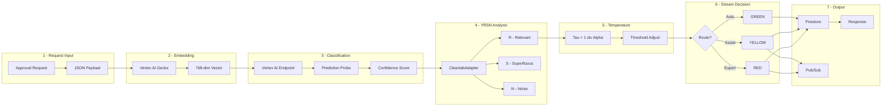

---

## GCP Workflows State Machine

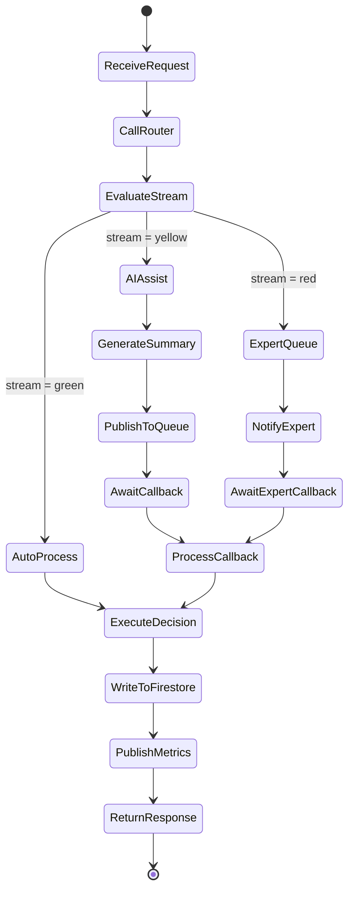

---

## Comparison: AWS vs GCP Services

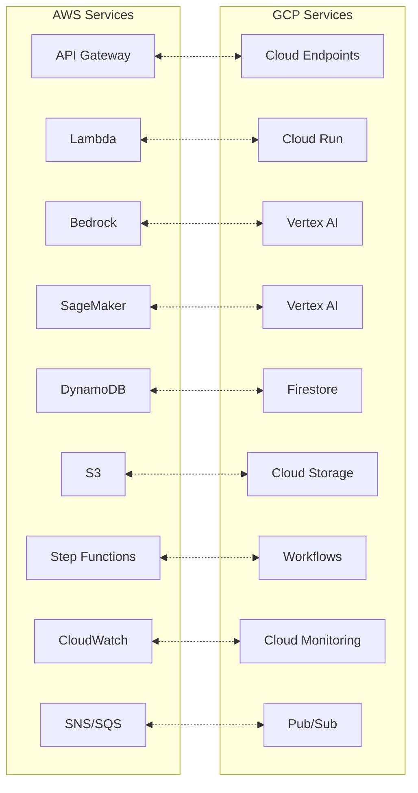

---

## Temperature-Quality Duality Flow

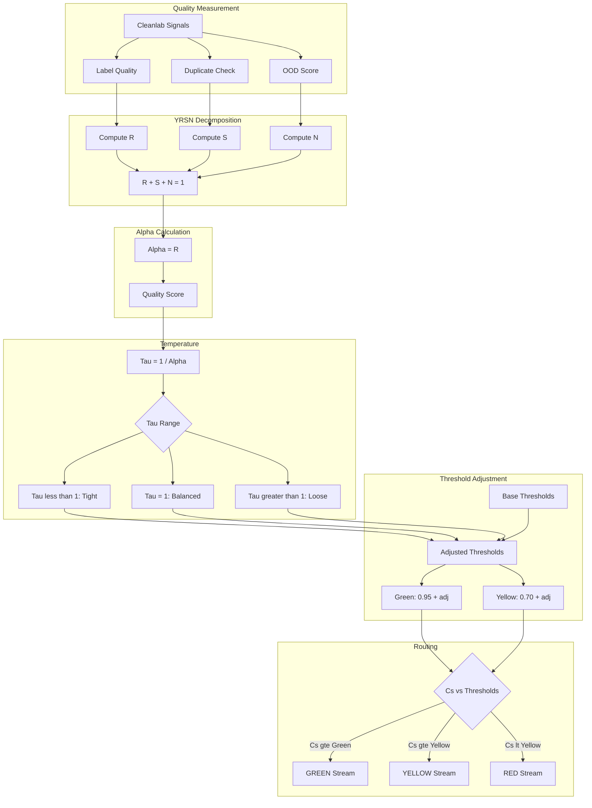

---

## Collapse Type Detection

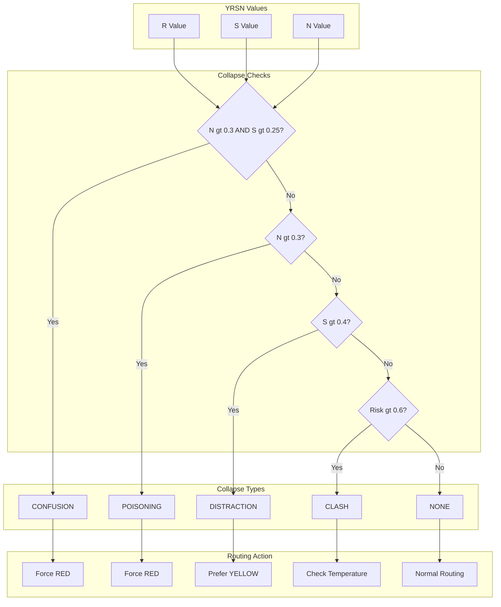

---

## Urgency Scoring Formula

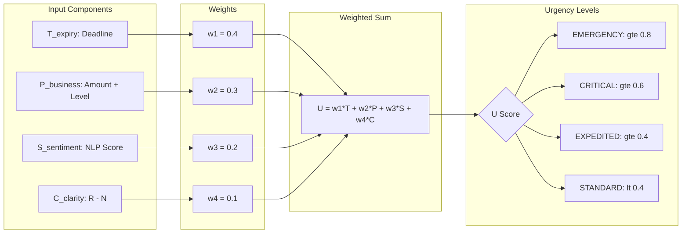

---

## Multi-Region Deployment (AWS)

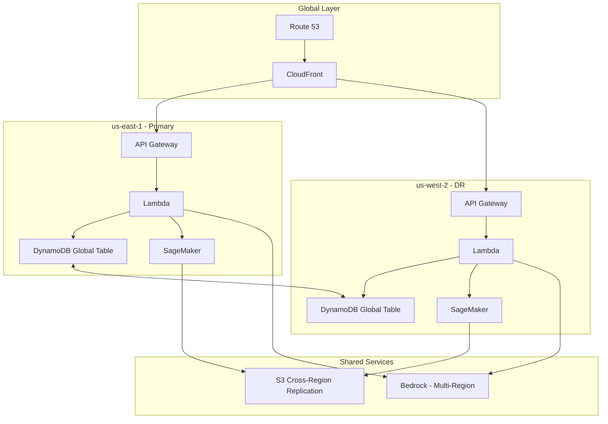

---

## Multi-Region Deployment (GCP)

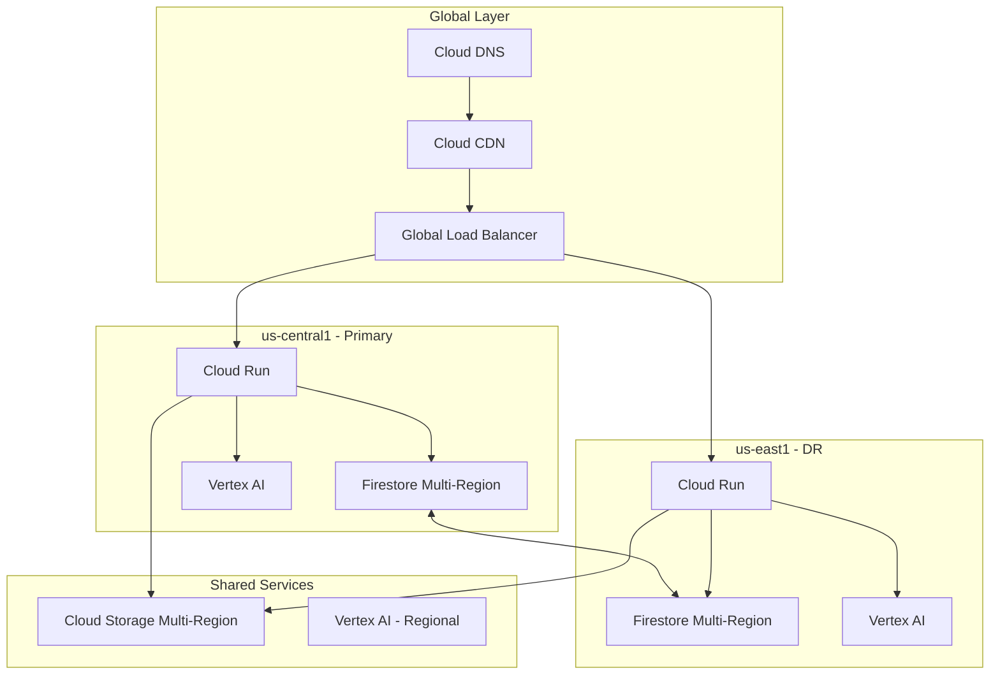

---

## Security Architecture

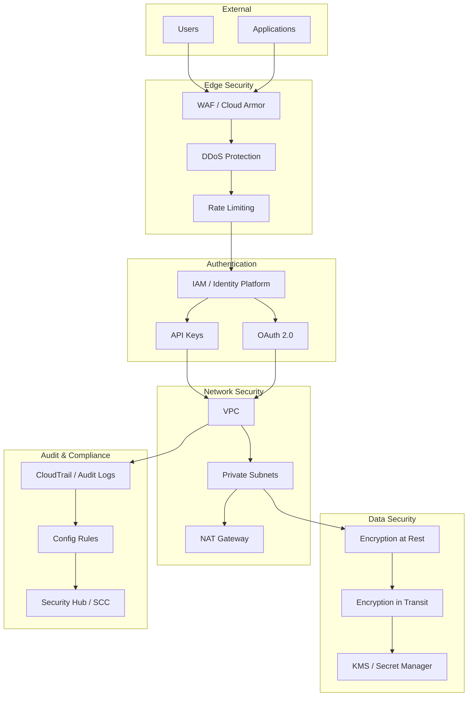

---

## CI/CD Pipeline

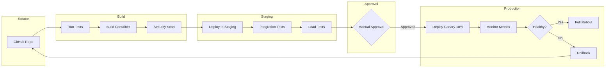

---

## Monitoring Dashboard Layout

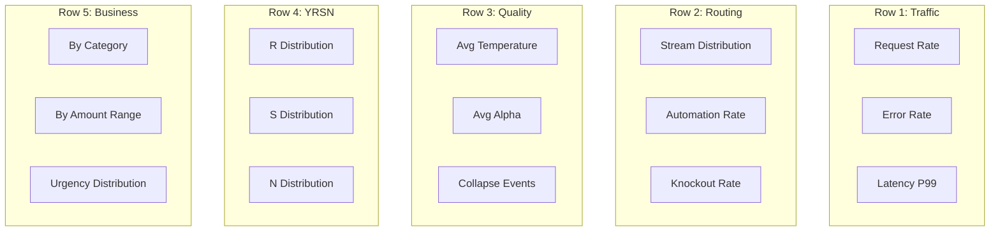

---

*These diagrams are GitHub-compatible and will render correctly in GitHub markdown files.*
